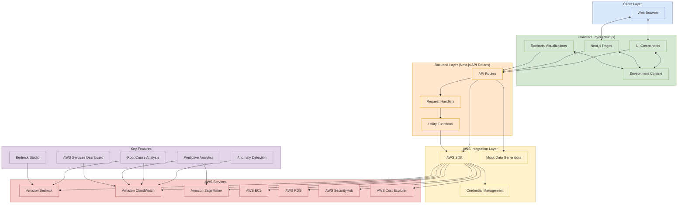

# AWS AIOps Dashboard Architecture

Below is a visual representation of the AWS AIOps Dashboard architecture using a Mermaid diagram. This diagram shows the key components and their relationships.

## Architecture Components Explained

### 1. Client Layer
- **Web Browser**: The user interface where users interact with the dashboard

### 2. Frontend Layer (Next.js)
- **UI Components**: Reusable UI elements (ModelSelector, PromptBuilder, TimeSeriesChart, etc.)
- **Next.js Pages**: Page components for different sections of the dashboard
- **Recharts Visualizations**: Data visualization components
- **Environment Context**: State management for switching between Dev/UAT/Prod environments

### 3. Backend Layer (Next.js API Routes)
- **API Routes**: Server-side endpoints handling data requests
- **Request Handlers**: Logic for processing requests
- **Utility Functions**: Shared functions for AWS credential management, data processing, etc.

### 4. AWS Integration Layer
- **AWS SDK**: Integration with AWS services
- **Credential Management**: Handles environment-specific AWS credentials
- **Mock Data Generators**: Provides realistic mock data when AWS credentials aren't available

### 5. AWS Services
- **Amazon Bedrock**: Powers AI-driven features
- **CloudWatch**: Provides metrics data
- **SageMaker**: Enables predictive analytics
- **Other AWS Services**: EC2, RDS, SecurityHub, CostExplorer, etc.

### 6. Key Features
- **Anomaly Detection**: Identifies unusual patterns in CloudWatch metrics
- **Root Cause Analysis (RCA)**: Uses Bedrock to analyze anomalies
- **Predictive Analytics**: Forecasts resource utilization
- **Bedrock Studio**: Interface for interacting with Amazon Bedrock models
- **AWS Services Dashboard**: Monitoring dashboard for CloudWatch metrics

## Data Flow

1. User interacts with the Next.js frontend through their browser
2. Frontend makes requests to Next.js API routes
3. API routes use AWS SDK to call appropriate AWS services
4. AWS credentials are selected based on the current environment (Dev/UAT/Prod)
5. If AWS credentials aren't available, mock data generators provide realistic sample data
6. Data from AWS services or mock generators is processed and returned to the frontend
7. Frontend renders the data in the UI
