# AWS AIOps Features Architecture

This diagram focuses specifically on the AIOps features of the dashboard: Anomaly Detection, Root Cause Analysis (RCA), and Predictive Analytics. It shows how these features interact with AWS services and the data flow between components.

```mermaid
flowchart TD
    %% User Interface Components
    subgraph UI["User Interface"]
        TimeSeriesChart["TimeSeriesChart Component"]
        AnomalyCorrelation["AnomalyCorrelation Component"]
        RCADisplay["RCADisplay Component"]
        PredictiveChart["PredictiveChart Component"]
    end
    
    %% API Routes
    subgraph API["API Routes"]
        AnomalyAPI["/api/anomalies"]
        RCAAPI["/api/anomalies/rca"]
        PredictAPI["/api/predict/metrics"]
    end
    
    %% AWS Services
    subgraph AWS["AWS Services"]
        CloudWatch["Amazon CloudWatch"]
        Bedrock["Amazon Bedrock"]
        SageMaker["Amazon SageMaker"]
    end
    
    %% Data Flow for Anomaly Detection
    TimeSeriesChart -->|"1. User clicks on anomaly"| RCAAPI
    AnomalyCorrelation -->|"Shows correlated metrics"| AnomalyAPI
    
    AnomalyAPI -->|"2. Fetch metrics"| CloudWatch
    CloudWatch -->|"3. Return metrics data"| AnomalyAPI
    AnomalyAPI -->|"4. Process & return anomalies"| TimeSeriesChart
    AnomalyAPI -->|"Return correlation data"| AnomalyCorrelation
    
    %% Data Flow for Root Cause Analysis
    RCAAPI -->|"5. Fetch related metrics"| CloudWatch
    CloudWatch -->|"6. Return related metrics"| RCAAPI
    RCAAPI -->|"7. Send prompt with context"| Bedrock
    Bedrock -->|"8. Return AI analysis"| RCAAPI
    RCAAPI -->|"9. Return RCA results"| RCADisplay
    
    %% Data Flow for Predictive Analytics
    PredictiveChart -->|"10. Request predictions"| PredictAPI
    PredictAPI -->|"11. Fetch historical data"| CloudWatch
    CloudWatch -->|"12. Return historical metrics"| PredictAPI
    PredictAPI -->|"13. Send data for prediction"| SageMaker
    SageMaker -->|"14. Return predictions"| PredictAPI
    PredictAPI -->|"15. Return historical + predicted data"| PredictiveChart
    
    %% Fallback paths for when AWS credentials aren't available
    RCAAPI -.->|"5a. No AWS credentials"| MockRCA["Mock RCA Generator"]
    MockRCA -.->|"8a. Return mock analysis"| RCAAPI
    
    PredictAPI -.->|"11a. No AWS credentials"| MockHistory["Mock Historical Data"]
    MockHistory -.->|"12a. Return mock data"| PredictAPI
    
    PredictAPI -.->|"13a. No SageMaker access"| MockPredict["Mock Prediction Generator"]
    MockPredict -.->|"14a. Return mock predictions"| PredictAPI
    
    %% Styling
    classDef ui fill:#d5e8d4,stroke:#82b366
    classDef api fill:#ffe6cc,stroke:#d79b00
    classDef aws fill:#f8cecc,stroke:#b85450
    classDef mock fill:#fff2cc,stroke:#d6b656
    
    class UI,TimeSeriesChart,AnomalyCorrelation,RCADisplay,PredictiveChart ui
    class API,AnomalyAPI,RCAAPI,PredictAPI api
    class AWS,CloudWatch,Bedrock,SageMaker aws
    class MockRCA,MockHistory,MockPredict mock
```

## Detailed Feature Descriptions

### 1. Anomaly Detection

The Anomaly Detection feature identifies unusual patterns in CloudWatch metrics and visualizes them in the UI.

**Components:**
- **TimeSeriesChart**: Displays metric data with anomalies highlighted
- **AnomalyCorrelation**: Shows correlation between different metrics during anomaly periods
- **API Route**: `/api/anomalies` fetches and processes metric data

**Data Flow:**
1. Frontend requests metric data from the API
2. API fetches data from CloudWatch or uses mock data if AWS credentials aren't available
3. API processes the data to identify anomalies using statistical methods
4. Frontend displays the data with anomalies highlighted
5. User can click on an anomaly to trigger Root Cause Analysis

### 2. Root Cause Analysis (RCA)

The RCA feature uses Amazon Bedrock to analyze anomalies and suggest potential causes.

**Components:**
- **RCADisplay**: Shows the analysis results including root cause, evidence, and suggestions
- **API Route**: `/api/anomalies/rca` handles the analysis process

**Data Flow:**
1. User clicks on an anomaly in the TimeSeriesChart
2. Frontend sends anomaly details to the RCA API
3. API fetches related metrics from CloudWatch to provide context
4. API constructs a prompt with the anomaly details and context
5. API sends the prompt to Amazon Bedrock for analysis
6. Bedrock returns an AI-generated analysis
7. API processes the analysis and returns it to the frontend
8. Frontend displays the analysis in the RCADisplay component

### 3. Predictive Analytics

The Predictive Analytics feature forecasts future metric values based on historical data.

**Components:**
- **PredictiveChart**: Displays historical data and predictions
- **API Route**: `/api/predict/metrics` handles data fetching and prediction

**Data Flow:**
1. Frontend requests predictions for a specific metric and time range
2. API fetches historical data from CloudWatch
3. API sends the historical data to SageMaker for prediction
4. SageMaker returns predicted values
5. API combines historical and predicted data
6. Frontend displays the combined data in the PredictiveChart

### 4. Fallback Mechanisms

All features include fallback mechanisms for when AWS credentials aren't available:

- **Mock Data Generators**: Provide realistic sample data that mimics real AWS metrics
- **Mock Predictions**: Generate plausible forecasts based on historical patterns
- **Mock RCA**: Simulate AI-generated analysis with realistic insights

This architecture ensures that the dashboard remains functional for demonstration purposes even without actual AWS credentials, while providing full functionality when proper credentials are configured.
