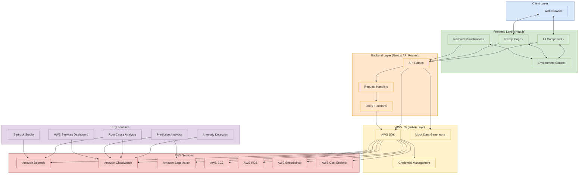
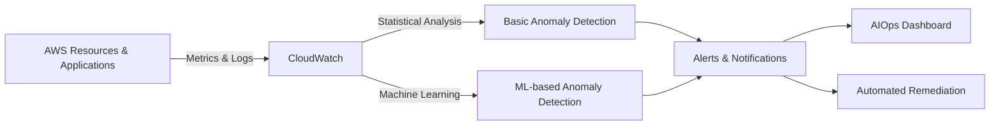
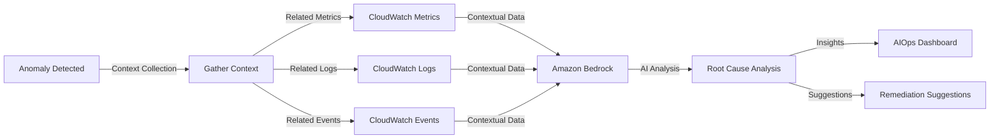
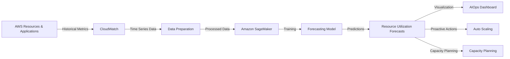

# AWS AIOps Mermaid Diagrams

This file contains all the Mermaid diagrams for the AWS AIOps Dashboard architecture and implementation patterns.

## 1. Overall Architecture Diagram

## 2. AIOps Features Architecture

```mermaid
flowchart TD
    %% User Interface Components
    subgraph UI["User Interface"]
        TimeSeriesChart["TimeSeriesChart Component"]
        AnomalyCorrelation["AnomalyCorrelation Component"]
        RCADisplay["RCADisplay Component"]
        PredictiveChart["PredictiveChart Component"]
    end
    
    %% API Routes
    subgraph API["API Routes"]
        AnomalyAPI["/api/anomalies"]
        RCAAPI["/api/anomalies/rca"]
        PredictAPI["/api/predict/metrics"]
    end
    
    %% AWS Services
    subgraph AWS["AWS Services"]
        CloudWatch["Amazon CloudWatch"]
        Bedrock["Amazon Bedrock"]
        SageMaker["Amazon SageMaker"]
    end
    
    %% Data Flow for Anomaly Detection
    TimeSeriesChart -->|"1. User clicks on anomaly"| RCAAPI
    AnomalyCorrelation -->|"Shows correlated metrics"| AnomalyAPI
    
    AnomalyAPI -->|"2. Fetch metrics"| CloudWatch
    CloudWatch -->|"3. Return metrics data"| AnomalyAPI
    AnomalyAPI -->|"4. Process & return anomalies"| TimeSeriesChart
    AnomalyAPI -->|"Return correlation data"| AnomalyCorrelation
    
    %% Data Flow for Root Cause Analysis
    RCAAPI -->|"5. Fetch related metrics"| CloudWatch
    CloudWatch -->|"6. Return related metrics"| RCAAPI
    RCAAPI -->|"7. Send prompt with context"| Bedrock
    Bedrock -->|"8. Return AI analysis"| RCAAPI
    RCAAPI -->|"9. Return RCA results"| RCADisplay
    
    %% Data Flow for Predictive Analytics
    PredictiveChart -->|"10. Request predictions"| PredictAPI
    PredictAPI -->|"11. Fetch historical data"| CloudWatch
    CloudWatch -->|"12. Return historical metrics"| PredictAPI
    PredictAPI -->|"13. Send data for prediction"| SageMaker
    SageMaker -->|"14. Return predictions"| PredictAPI
    PredictAPI -->|"15. Return historical + predicted data"| PredictiveChart
    
    %% Fallback paths for when AWS credentials aren't available
    RCAAPI -.->|"5a. No AWS credentials"| MockRCA["Mock RCA Generator"]
    MockRCA -.->|"8a. Return mock analysis"| RCAAPI
    
    PredictAPI -.->|"11a. No AWS credentials"| MockHistory["Mock Historical Data"]
    MockHistory -.->|"12a. Return mock data"| PredictAPI
    
    PredictAPI -.->|"13a. No SageMaker access"| MockPredict["Mock Prediction Generator"]
    MockPredict -.->|"14a. Return mock predictions"| PredictAPI
    
    %% Styling
    classDef ui fill:#d5e8d4,stroke:#82b366
    classDef api fill:#ffe6cc,stroke:#d79b00
    classDef aws fill:#f8cecc,stroke:#b85450
    classDef mock fill:#fff2cc,stroke:#d6b656
    
    class UI,TimeSeriesChart,AnomalyCorrelation,RCADisplay,PredictiveChart ui
    class API,AnomalyAPI,RCAAPI,PredictAPI api
    class AWS,CloudWatch,Bedrock,SageMaker aws
    class MockRCA,MockHistory,MockPredict mock
```

## 3. Anomaly Detection Pattern

## 4. Root Cause Analysis Pattern

## 5. Predictive Analytics Pattern

## How to Use These Diagrams

1. **View in GitHub**: If you push this file to a GitHub repository, GitHub will automatically render the Mermaid diagrams.

2. **VS Code Extension**: Install the "Markdown Preview Mermaid Support" extension in VS Code to view the diagrams directly in the VS Code markdown preview.

3. **Mermaid Live Editor**: Copy the Mermaid code (the content between the \`\`\`mermaid and \`\`\` tags) and paste it into the [Mermaid Live Editor](https://mermaid.live/) to view and export the diagrams in various formats.

4. **Draw.io**: Use these diagrams as a reference to create more detailed diagrams in draw.io with AWS architecture icons.
