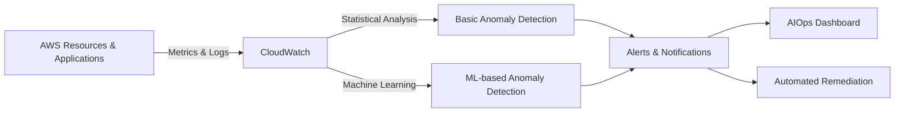
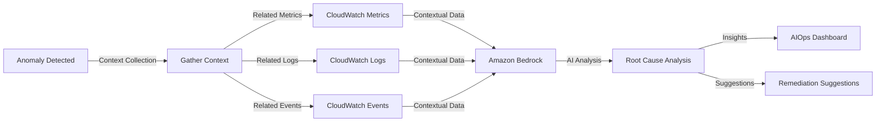
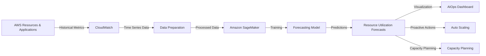

# AWS AIOps Solutions

This document provides an overview of AIOps (Artificial Intelligence for IT Operations) solutions that can be implemented using AWS services, based on the architecture and features of the AWS AIOps Dashboard.

## What is AIOps?

AIOps refers to the application of artificial intelligence and machine learning techniques to IT operations data and processes. The goal is to improve IT operations through:

- Automated anomaly detection
- Root cause analysis
- Predictive analytics
- Intelligent alerting
- Automated remediation

## Key AWS Services for AIOps

### 1. Amazon CloudWatch

CloudWatch is the foundation for AIOps on AWS, providing:

- **Metrics collection** from AWS resources and applications
- **Logs collection and analysis**
- **Alarms** based on metric thresholds
- **Anomaly detection** using machine learning algorithms
- **Dashboards** for visualization
- **ServiceLens** for tracing and application insights

### 2. Amazon Bedrock

Amazon Bedrock provides foundation models that can be used for:

- **Root cause analysis** of anomalies and incidents
- **Log analysis** to identify patterns and issues
- **Natural language processing** of alerts and documentation
- **Summarization** of incident reports
- **Generating remediation suggestions** based on historical data

### 3. Amazon SageMaker

SageMaker enables custom machine learning models for:

- **Predictive analytics** for resource utilization forecasting
- **Anomaly detection** with custom algorithms
- **Capacity planning** based on historical trends
- **Failure prediction** for infrastructure components
- **Custom classification** of incidents and alerts

### 4. AWS Lambda

Lambda provides serverless compute for:

- **Automated remediation** of common issues
- **Event-driven responses** to anomalies
- **Data preprocessing** for machine learning models
- **Integration** between different AWS services

### 5. Amazon EventBridge

EventBridge enables event-driven architectures for:

- **Real-time event processing** from multiple sources
- **Automated workflows** triggered by anomalies or alerts
- **Service integration** across the AWS ecosystem

## AIOps Implementation Patterns

### 1. Anomaly Detection Pattern

This pattern focuses on identifying unusual behavior in metrics and logs:

**Implementation Steps:**
1. Configure CloudWatch metrics collection for all relevant resources
2. Set up CloudWatch Anomaly Detection for key metrics
3. Create alarms based on anomaly detection bands
4. Configure notifications via SNS or EventBridge
5. Implement automated remediation with Lambda (optional)
6. Visualize anomalies in a dashboard

### 2. Root Cause Analysis Pattern

This pattern uses AI to analyze anomalies and determine their root causes:

**Implementation Steps:**
1. Set up a workflow triggered by anomaly detection
2. Gather contextual data (metrics, logs, events) around the anomaly
3. Format the data into a prompt for Amazon Bedrock
4. Use Bedrock to analyze the data and generate insights
5. Present the analysis in a dashboard with remediation suggestions

### 3. Predictive Analytics Pattern

This pattern forecasts future resource utilization and potential issues:

**Implementation Steps:**
1. Collect historical metrics data from CloudWatch
2. Prepare and preprocess the data for time series forecasting
3. Train a forecasting model using SageMaker (or use built-in algorithms)
4. Generate predictions for future resource utilization
5. Visualize predictions alongside historical data
6. Configure proactive actions based on predictions (optional)

## AWS AIOps Dashboard Implementation

The AWS AIOps Dashboard combines these patterns into a comprehensive solution:

1. **Anomaly Detection**
   - Uses CloudWatch metrics to identify unusual patterns
   - Visualizes anomalies in time series charts
   - Shows correlation between different metrics during anomaly periods

2. **Root Cause Analysis**
   - Triggered when a user clicks on an anomaly
   - Gathers related metrics, logs, and events for context
   - Uses Amazon Bedrock to analyze the anomaly and suggest potential causes
   - Presents the analysis with evidence and remediation suggestions

3. **Predictive Analytics**
   - Fetches historical metrics data from CloudWatch
   - Uses SageMaker or built-in algorithms for forecasting
   - Displays historical data alongside predictions
   - Enables proactive resource management

4. **Environment Management**
   - Supports multiple environments (Dev, UAT, Prod)
   - Uses environment-specific AWS credentials
   - Provides consistent experience across environments
   - Includes fallback to mock data when AWS credentials aren't available

## Benefits of AWS AIOps

1. **Reduced Mean Time to Detection (MTTD)**
   - Automated anomaly detection identifies issues faster than manual monitoring
   - ML-based detection can find subtle issues that rule-based systems miss

2. **Reduced Mean Time to Resolution (MTTR)**
   - AI-powered root cause analysis speeds up troubleshooting
   - Remediation suggestions guide operators to faster resolution

3. **Proactive Operations**
   - Predictive analytics enables addressing issues before they impact users
   - Capacity planning prevents resource constraints

4. **Operational Efficiency**
   - Automation reduces manual monitoring and analysis
   - Centralized dashboard provides comprehensive visibility

5. **Cost Optimization**
   - Predictive scaling ensures resources match demand
   - Early detection prevents costly outages

## Getting Started with AWS AIOps

1. **Start with CloudWatch**
   - Set up comprehensive metrics collection
   - Configure basic anomaly detection
   - Create dashboards for visualization

2. **Add AI/ML Capabilities**
   - Integrate Amazon Bedrock for root cause analysis
   - Implement SageMaker for predictive analytics
   - Use Lambda for automated remediation

3. **Build or Adopt an AIOps Dashboard**
   - Implement a custom dashboard like the AWS AIOps Dashboard
   - Or use AWS-managed services like CloudWatch Dashboards and Application Insights

4. **Iterate and Improve**
   - Continuously refine anomaly detection thresholds
   - Improve AI prompts for better root cause analysis
   - Train more accurate prediction models with more data

## Conclusion

AWS provides a comprehensive set of services for implementing AIOps solutions. By combining CloudWatch, Bedrock, SageMaker, and other AWS services, organizations can build powerful AIOps capabilities that improve operational efficiency, reduce downtime, and enable proactive IT operations.

The AWS AIOps Dashboard demonstrates how these services can be integrated into a cohesive solution that provides anomaly detection, root cause analysis, and predictive analytics in a single interface.
